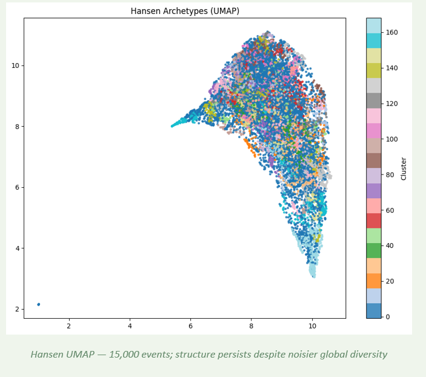
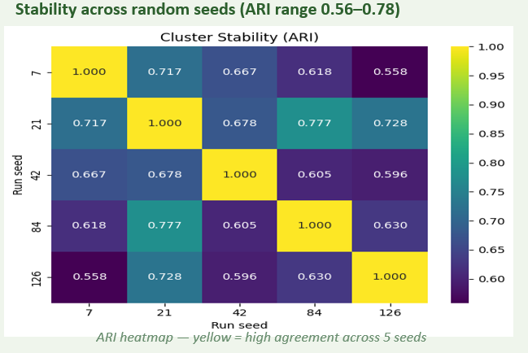
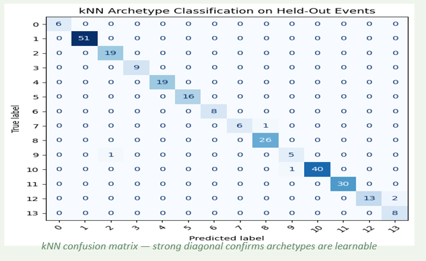
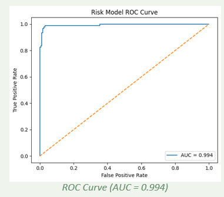
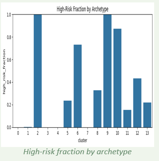
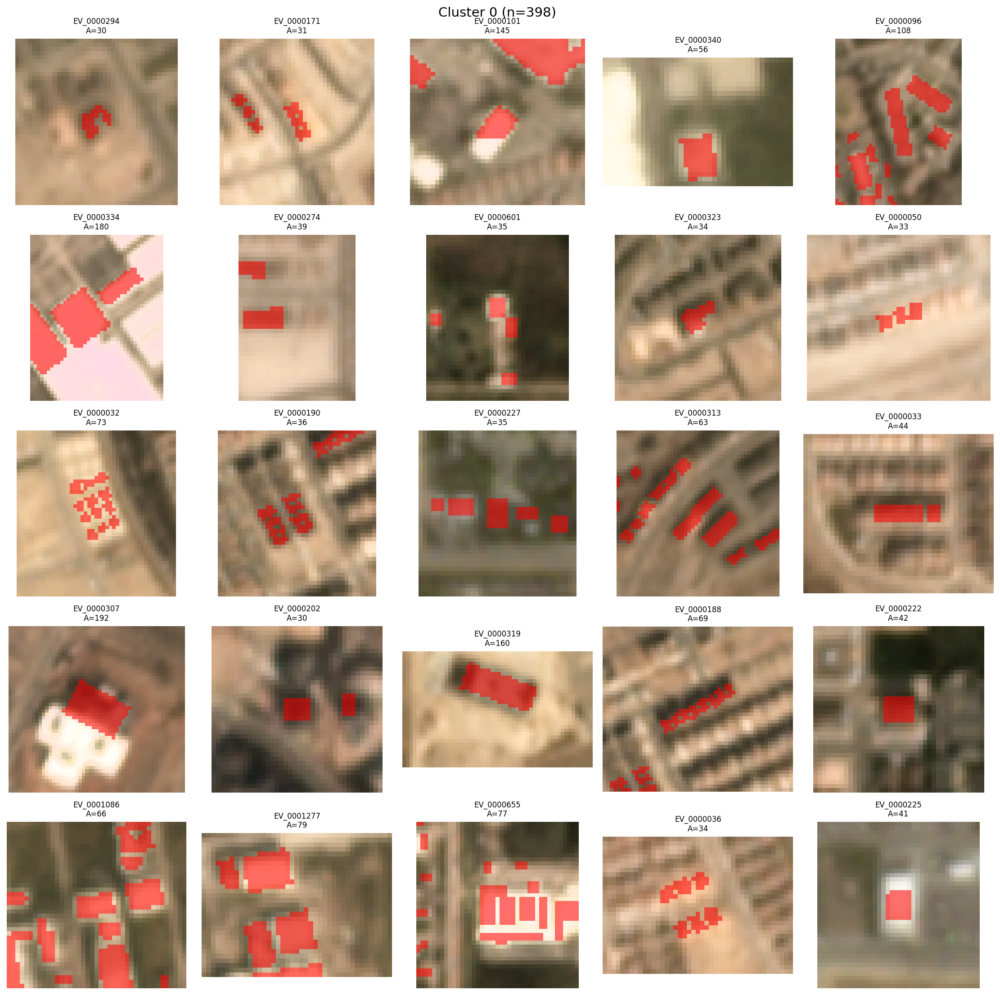
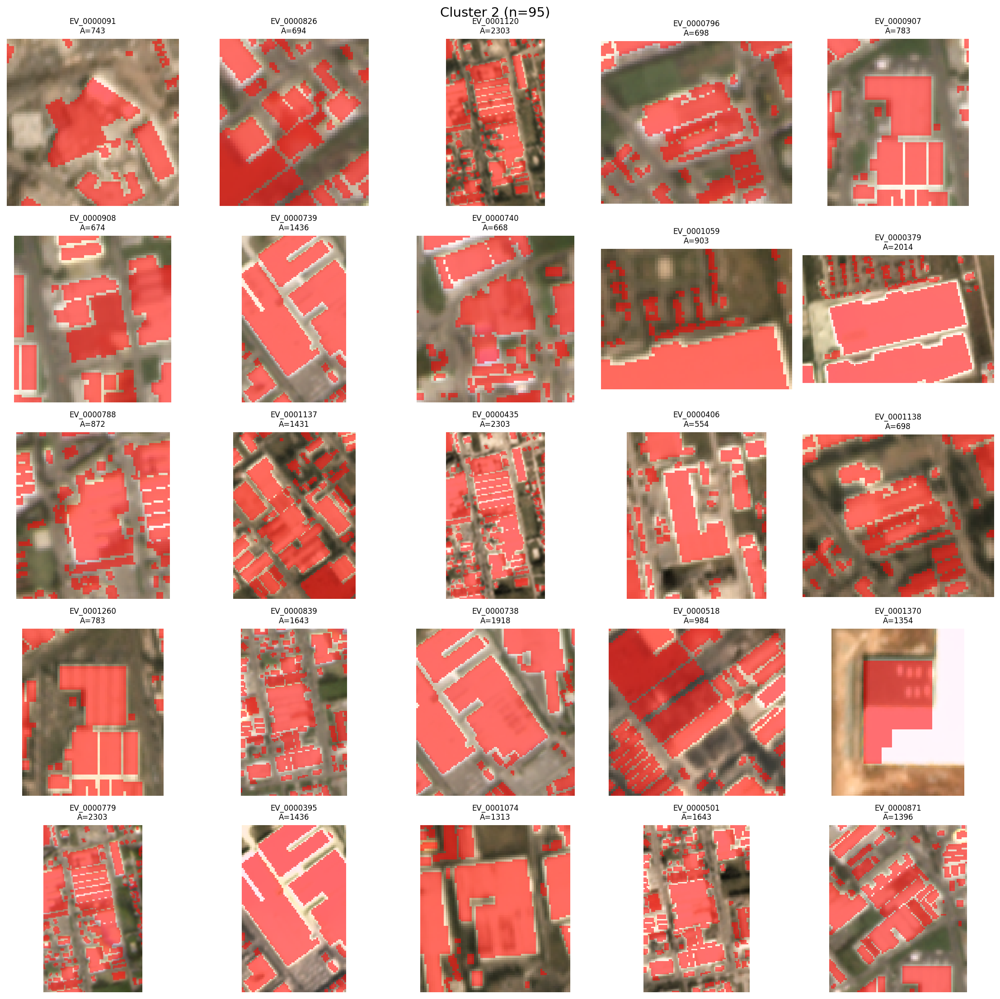
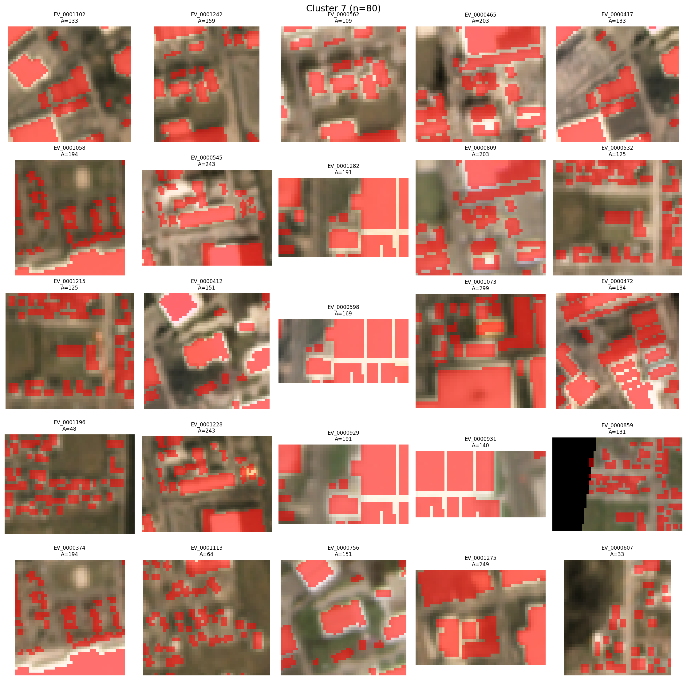
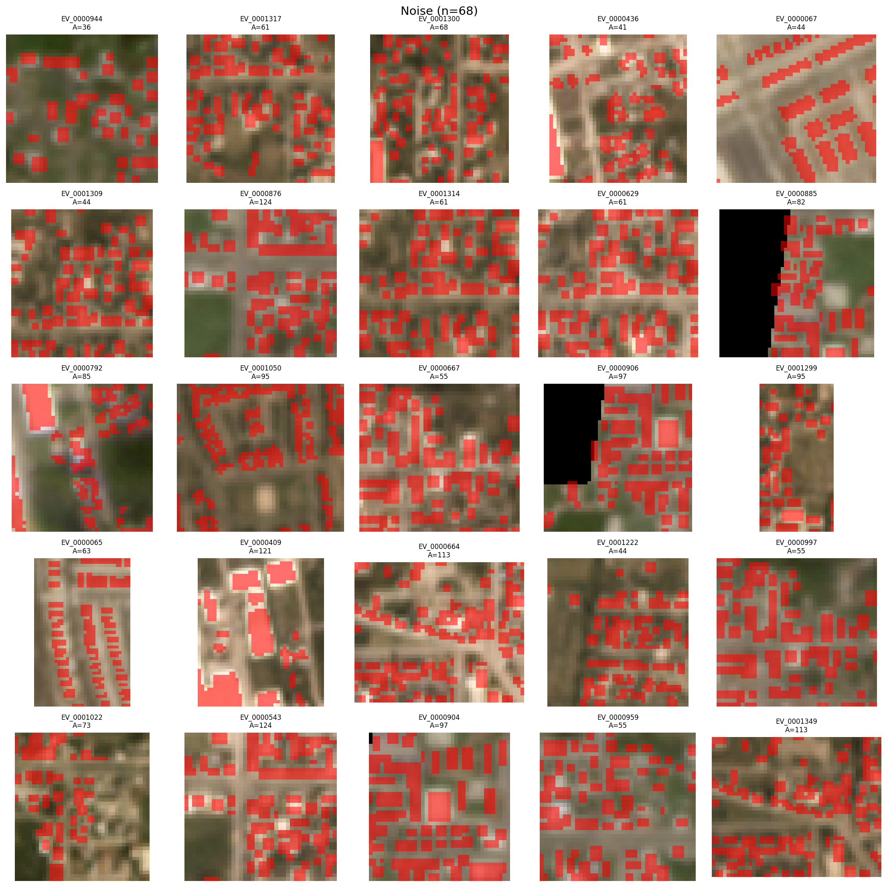

# Deforestation Archetype Discovery

## Team

- Akash Sagi
- Sakethram Naidu


## Project Summary

This project studies deforestation as an event-level pattern discovery problem. Instead of only detecting where forest loss happens, we extract connected deforestation events, measure their geometric and visual properties, and use unsupervised learning to discover recurring deforestation archetypes.

## Overview

Global forest monitoring systems such as Hansen Global Forest Change detect where and when forest loss occurs, but not what kind of loss it is.

This project reframes deforestation as an event-level pattern discovery problem. Instead of treating forest loss as isolated pixels, we group connected deforestation events and uncover recurring geometric archetypes using unsupervised learning.

## Dataset

### Data Sources

- Hansen Global Forest Change for annual forest loss maps at 30 meter resolution
- Sentinel-2 imagery for optional higher-resolution visual refinement at 10 to 20 meter resolution
- SpaceNet 7 data used in the current pipeline and download workflow

### Unit of Analysis

We convert pixel-level forest loss into event-level patches:

1. Forest loss map to binary raster
2. Connected components to grouped neighboring loss pixels
3. Event patch to one deforestation event

### Feature Representation

Each event is represented with geometric and context-aware features such as:

- Area
- Compactness
- Eccentricity
- Aspect ratio
- Edge density
- Mask fraction

### Dataset Scale

- Thousands of event patches in the core experiments
- Extended evaluation on approximately 15,000 global events

## Quick Results

- 14 clusters discovered from event-level features
- Approximately 5.6% of events were labeled as noise
- The discovered archetypes include linear, blocky, and fragmented patterns that may correspond to different deforestation processes

## Key Idea

Event shape can encode the underlying deforestation process.

Different drivers such as agriculture, roads, and logging can produce distinct spatial patterns, so clustering event geometry provides a way to discover deforestation archetypes without manual labels.

## Method

### 1. Event Extraction

- Convert forest loss maps into connected deforestation components

### 2. Feature Engineering

- Compute event-level geometric features
- Compute visual and contextual features from the extracted event crops

### 3. Clustering

- HDBSCAN for unsupervised clustering
- No predefined number of clusters required
- Robust handling of noise points

### 4. Interpretation

- Visualize cluster galleries
- Summarize cluster statistics
- Inspect mean masks and representative event samples

## Visualizations

Project result figures:







Sample archetype galleries from the generated outputs:






Additional result images are available in `result-images/` and `outputs/archetypes/`.

## Interpretation

Example archetype interpretations from the discovered clusters:

| Archetype | Likely Process |
|-----------|----------------|
| Linear | Roads and infrastructure |
| Blocky | Agriculture |
| Fragmented | Logging |

These interpretations are exploratory and are not ground-truth labels.

## Generalization

- The archetype structure was also evaluated on a larger global event set
- The clustering structure persists even with additional noise and scale variation

## Risk Model

As an exploratory extension, the project also studies cluster-level risk behavior:

- ROC-AUC approximately 0.994 in the reported experiment
- High-risk fractions differ across discovered clusters

This is not an independent validation setting because it uses the same feature space as the clustering pipeline.

## Folder Structure

```text
deforestation-archetypes/
|-- Deforestation_archetypes_clean.ipynb
|-- deforestation_archetypes_presentation.pptx
|-- download_data.py
|-- README.md
|-- SS24BC_SN24I_Deforestation Archetypes_Report.pdf
|-- sn7_imagepair_manifest.csv
|-- outputs/
|   `-- archetypes/
|       |-- cluster_00_gallery.png
|       |-- cluster_00_meanmask.png
|       |-- cluster_01_gallery.png
|       |-- cluster_01_meanmask.png
|       |-- cluster_02_gallery.png
|       |-- cluster_02_meanmask.png
|       |-- cluster_03_gallery.png
|       |-- cluster_03_meanmask.png
|       |-- cluster_04_gallery.png
|       |-- cluster_04_meanmask.png
|       |-- cluster_05_gallery.png
|       |-- cluster_05_meanmask.png
|       |-- cluster_06_gallery.png
|       |-- cluster_06_meanmask.png
|       |-- cluster_07_gallery.png
|       |-- cluster_07_meanmask.png
|       |-- cluster_08_gallery.png
|       |-- cluster_08_meanmask.png
|       |-- cluster_09_gallery.png
|       |-- cluster_09_meanmask.png
|       |-- cluster_10_gallery.png
|       |-- cluster_10_meanmask.png
|       |-- cluster_noise_gallery.png
|       |-- cluster_noise_meanmask.png
|       |-- cluster_stats.csv
|       |-- event_clusters_shapeonly.csv
|       `-- README.txt
|-- result-images/
|   |-- cluster_stability_ari.png
|   |-- hansen_archetypes_umap.png
|   |-- high_risk_fraction_by_cluster.png
|   |-- knn_confusion_matrix.png
|   `-- risk_model_roc.png
`-- src/
    |-- build_manifest_sn7.py
    |-- build_manifest_sn7_from_images.py
    |-- extract_events.py
    |-- step2_tile_pairs.py
    |-- step3_build_change_masks_from_geojson.py
    |-- step3_build_change_masks_from_geojson_pixel.py
    |-- step4_extract_events.py
    |-- step4_extract_events_pixel.py
    |-- step5_extract_event_features.py
    |-- step6_cluster_events.py
    `-- step7_interpret_clusters.py
```

## How To Run The Project

The easiest way to run this project is in Google Colab.

### Option 1: Run the notebook in Colab

1. Clone or upload this repository to Google Drive.
2. Rename the project folder to `deforestation_archetypes` if needed.
3. Place the folder at `MyDrive/deforestation_archetypes` because the notebook and scripts use that exact path.
4. Open `Deforestation_archetypes_clean.ipynb` in Google Colab.
5. Mount Google Drive in Colab when prompted.
6. Run the notebook cells in order from top to bottom.
7. If the dataset is not already present in Drive, run the data download step first.

Expected project location in Colab:

```text
/content/drive/MyDrive/deforestation_archetypes
```

### Option 2: Run the scripts manually

The scripts in `src/` are also organized as a step-by-step pipeline:

1. Build or load the dataset manifest
2. Create tile pairs and change masks
3. Extract deforestation events
4. Extract event-level features and embeddings
5. Cluster events into archetypes
6. Interpret and visualize cluster outputs

These scripts currently assume the same Colab/Drive project root:

```text
/content/drive/MyDrive/deforestation_archetypes
```

## Data Download Instructions

This repository does not store the full dataset directly in GitHub.

Use one of the following data access methods:

- Run `download_data.py` to download SpaceNet 7 data into your Google Drive project folder
- Access the project data and outputs here: [Google Drive folder](https://drive.google.com/drive/folders/1JmSbuaztQJrZbZ-y1q3aQ5b4uqqN-6eX?usp=drive_link)

`download_data.py` is currently configured to download into:

```text
/content/drive/MyDrive/deforestation_archetypes/data
```

## Setup Notes

If you run this in Colab, install any missing Python packages in a setup cell before executing the rest of the notebook. The project uses:

- Python
- NumPy
- Pandas
- scikit-learn
- HDBSCAN
- UMAP
- Matplotlib
- rasterio
- scikit-image
- PyTorch
- torchvision
- boto3

## Outputs

Current clustering outputs are written under `outputs/archetypes/`, including:

- `event_clusters_shapeonly.csv`
- `cluster_stats.csv`
- `cluster_XX_gallery.png`
- `cluster_XX_meanmask.png`

## Slides And Final Report

- Presentation slides: `deforestation_archetypes_presentation.pptx`
- Final report: `SS24BC_SN24I_Deforestation Archetypes_Report.pdf`


